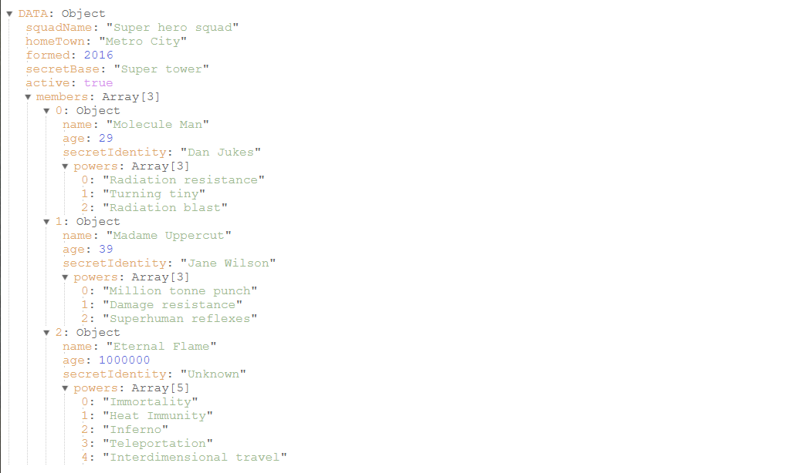

# Vue JSON Print

Pretty prints JSON object in a collapsible tree view. A react version is available [here](https://www.npmjs.com/package/react-json-print).

Demo: https://tanmancan.github.io/examples/vue-json-print/


*example JSON from: https://developer.mozilla.org/en-US/docs/Learn/JavaScript/Objects/JSON*

## Install

```bash
npm install vue-json-print
```

## Usage

This package provides a single file component meant to work with your existing Vue app. To use, simply import the component and use within your app.

```javascript
import JsonTree from 'vue-json-print'
import Vue from 'vue';

Vue.component('json-tree', JsonTree);
```

### Using the `.vue` file directly.

In certain cases, such as server side rendering, you may need to access the `.vue` component file directly. The package provides the source component file that you can easily import into your project.

```javascript
import JsonTree from 'vue-json-print/src/components/JsonTree.vue';
```

## Props

### `dataObject`
#### type: (`string`|`number`|`boolean`|`null`|`object`|`array`)
#### default: `null`

The data to be printed. Can be primitives, objects, or arrays. All values must be valid JSON types and all object keys must be valid JSON type. (ie. `string` not `Symbol`);

```javascript
const myDataObject = {
  one: 1,
  two: 2,
  array: [
    true,
    false,
    'string',
  ],
};

<JsonTree :dataObject="myDataObject" />
```

### `dataString`
#### type: (`string`)
#### default: (`undefined`)

The data to be printed, provided as a valid JSON string. The string will be parsed via `JSON.parse`. If both `dataString` and `dataObject` are provided, the `dataObject` value will be used.

```javascript
const myDataString = '{"one":1, "two":2, "array":[true, false, "string"]}';

<JsonTree :dataString="myDataString" />
```

### `expanded`
#### type: (`boolean`)
#### default: `false`

Displays the entire tree in an expanded state. By default all nested nodes in the tree are collapsed.

```javascript
const myDataObject = {
  ...
};

<JsonTree expanded :dataObject="myDataObject" />
```

### `depth`
#### type: (`number`)
#### default: `0`

Limits how many levels deep to display child nodes. Value of `0` will print all child nodes. Useful for deeply nested data, when you want to limit the number of node displayed.

```javascript
const myDataObject = {
  ...
};

<JsonTree :depth="2" :dataObject="myDataObject" />
```

&copy; Tanveer Karim
